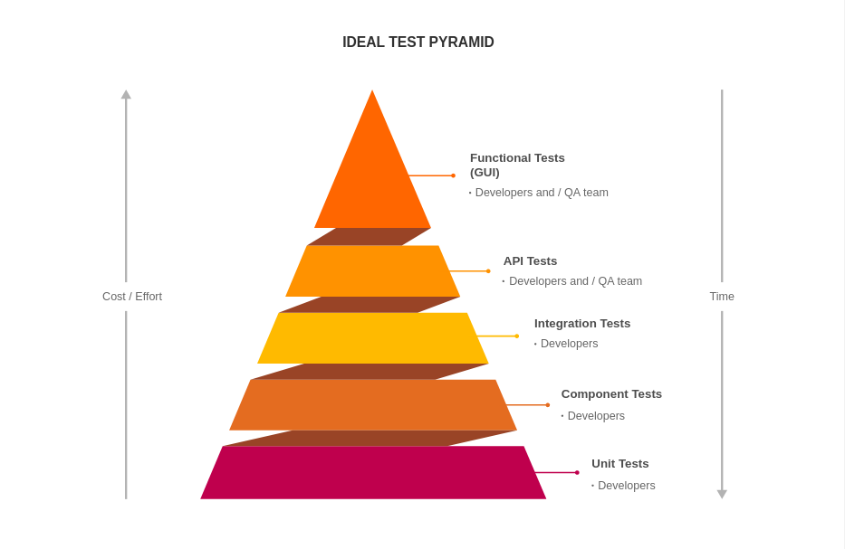

# Teste de Código

Testes são usados geralmente para quando a aplicação vai receber features novas.Com os testes é possível saber se a aplicação
está funcionando tudo como esperamos.

Formas de teste:
* Teste de caixa branca
* Teste de caixa preta
* Teste de regressão
* Teste de unidade
* Teste de integração
* Teste de carga
* Teste de usabilidade ou funcional
* Teste de estresse

Teste de caixa branca:é usado para testar componentes internos dentro de um módulo ou do sistema, de forma a verificar se a lógica condicional ou os blocos de repetição, dentre outras partes do código, estão corretos.
(Basicamente ver se a lógica ou o código está correto)

Teste de caixa preta:verifica se um componente ou sistema está correto avaliando o sistema de forma externa.Normalmente se enviam dados de entrada conhecidos para o sistema e a sua saída é comparada com o resultado esperado.
(Conhecidos tbm como inputs para testar o código)

Teste de regressão:Normalmente são testes realizados a cada nova versão de software, de maniera a testar se bugs ou falhas antigas persistem nas novas versões

Teste de unidade : é orientado para verificar se unidades menores de um software, como um método ou um loop, estão corretos.

Teste de integração:Essa forma de teste avalia se a comunicação(ou a integração) entre módulos distintos de um sistema funciona da maneira adequada.Muitas vezes, os módulos funcionam bem separadamente, mas, no meio da integração, podem surgir problemas de compatibilidade nas interfaces, por exemplo.

Teste de carga:esse tipo de teste avalia a capacidade ou limite de um software sem que ele apresente erros.

Teste de usabilidade ou funcional:Avalia se o comportamento de um sistema está conforme as expectativas dos usuários.

Teste de estresse:testa o comportamento do sistema quando se ultrapssa o seu limite, de modo a verificar como o software pode falahar nessas condições.

Existe uma metodologia de desenvolvimento de software que tornam obrigatória a elaboração de testes logo no início da construção de um sistema, como a linha do TDD(Test Driven Development)
consiste, em que primeiro se cria um teste e, somente depois de construído esse teste, o desenvolvimento do código é realizado.

## Processo de teste
Durante a formulação do processod e teste, é possível verificar quais testes serão importantes e, especificamente, quais serão automatizados.Porém, a construção deles demanda muito tempo e muitas vezes essa etapa é "pulada" para que as entregas sejam feitas.

Primeira etapa: é o planejamento dos testes, no qual as macroatividades serão identificadas e mapeadas quando o sistema é novo, enquanto, em etapas da evolução do sistema,é realizado o estudo do impacto das mudanças no sistema.
Ao longo desse mapeamento ,é feita uma análise ecnomica sobre os esforços necessários para testar cada feature do sistema.

Segunda etapa:o foco maior esa na elaboração da arquitetura dos testes, que se apresenta como uma estrutura a parte ou paralela a do sistema principal, ou , no caso de uso de uma ferramenta de testes, é realizado um levantamento dos requisits que essa ferramenta deve possuir para atender ao sistema.

Terceira etapa:são elaborados os critéiros de aceite dos testes como um todo, tanto manuais quanto os automatizados, assim como são realizadas estimativas sobre o impacto conomico da introdução dos testes no sistema, no sentido de que evitar uma falha nos momentos inicias do projeto é mais barato do que corrigir a mesma falha na véspera do release(lançamento) do sistema.

Quanto mais cedo uma falha é corrigida, maior é a chance de se evitar ter valor perdido ao se tentar consertar tardiamente uma funcionalidade com defeitos.Porém, acresentar muitos testes automatizados demanda tempo e aumenta o custo do projeto, pois uma parcela maior do tempo de desenvolvimento será dedicada para a elaboração de testes.Por isso, é necessaŕio chegar a um equilíbrio entre o esforço de automatização e a redução das chances de uma falha se estender até o lançamento do sistema.

Piramide representando o tradeoff entre os diferentes níveis de teste, seu custo e seu tempo de implementação.

Quanto mais elaborado é o teste, maior será o esforç e o custo envolvidos na sua criação, e seu tempo de execução também será maior.Geralmente os testes unitários e de componente são execustados a cada build de um sistema.Enquant os testes mais complexos , como os funcionais e de integração, são executados com menor frequencia, a cada dia ou semana, ou até mesmo antes de um release.

